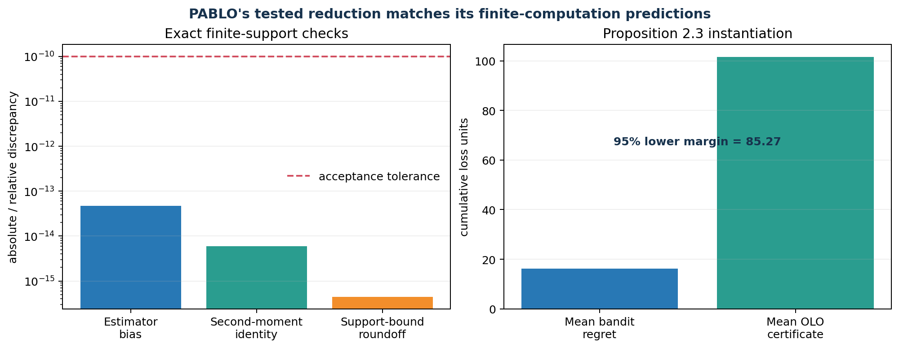
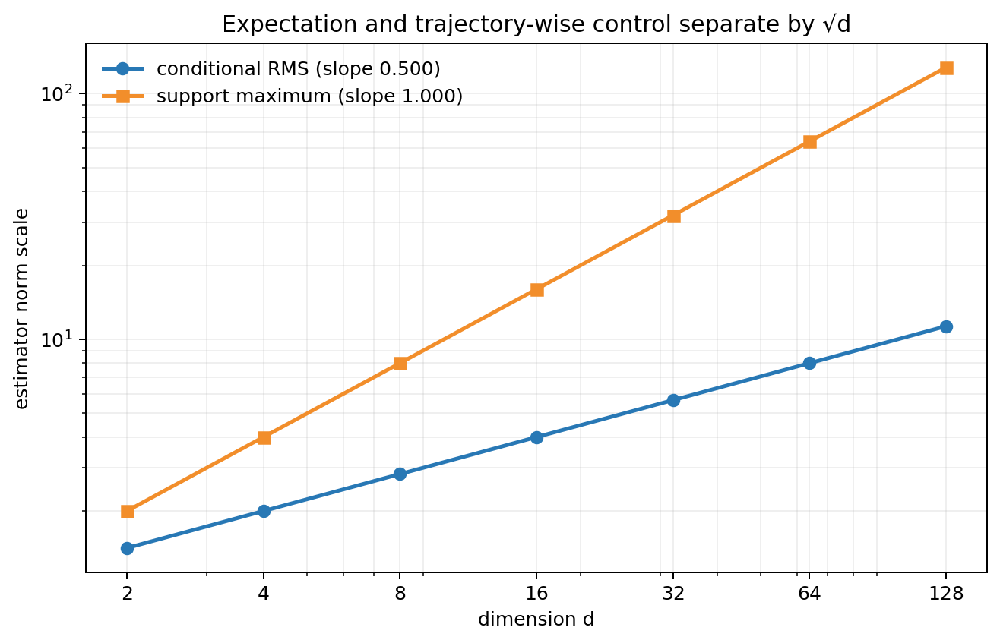
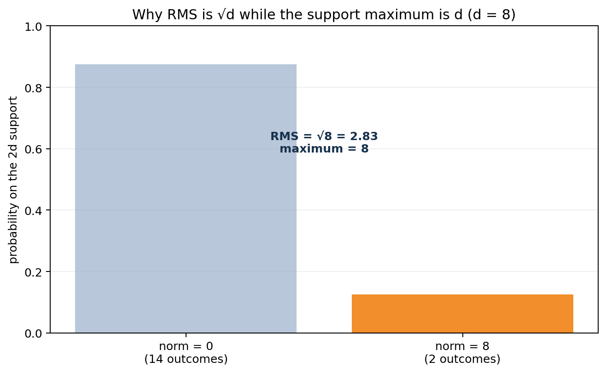
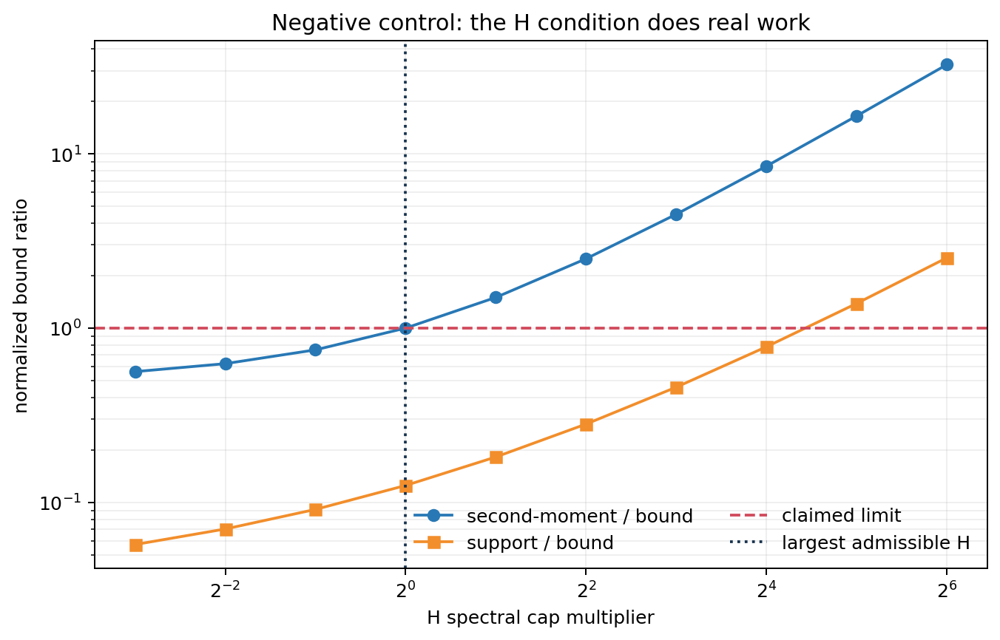

# PABLO under the microscope: an exact audit of a bandit-to-online-learning reduction



The central question is simple to state: can a learner that sees only one scalar loss per round manufacture a useful full loss vector? *A Perturbation Approach to Unconstrained Linear Bandits* answers yes. Its PABLO construction perturbs an online linear optimization (OLO) learner's action along one signed eigenvector, observes the scalar feedback, and feeds a rescaled vector estimate back to the learner.

This reproduction tests the construction where it is numerically falsifiable. It exhaustively enumerates the estimator's entire `2d` support, stress-tests its matrix condition, and instantiates the generic regret reduction with Euclidean online gradient descent (OGD). The strongest result is exact rather than asymptotic: over 80 random positive-definite geometries, the largest second-moment identity error was `5.93e-15` and the largest estimator bias was `4.68e-14`.

## What was tested

The paper is theoretical: it has no empirical result table and provides no official implementation. Its main claims combine a reusable estimator reduction with specialized parameter-free OLO subroutines. We therefore separate claims that admit direct finite tests from full regret theorems whose hidden constants and external subroutines make a small numerical “pass” misleading.

| Paper statement | Paper prediction | Observed evidence | Assessment |
|---|---:|---:|---|
| Proposition 2.1, unbiasedness | bias `= 0` | maximum L2 bias `4.68e-14` | **Aligned** |
| Proposition 2.1, second moment | relative identity error `= 0` | maximum `5.93e-15` | **Aligned** |
| Proposition 2.1, support bound | normalized ratio `≤ 1` | maximum `1 + 4.4e-16` (roundoff) | **Aligned** |
| Corollary 2.2 | moment and support ratios `≤ 1` | `0.872` and `0.868` | **Aligned** |
| Proposition 2.3 with OGD | expected regret `≤` two OLO certificates | `16.205` vs `101.546`; lower 95% margin `85.266` | **Aligned in this instantiation** |
| Theorem 3.1 dimension mechanism | RMS `O(√d)`, support `O(d)` | fitted slopes `0.500`, `1.000` | **Aligned mechanism** |
| Theorem 3.1 full PFMD rate | comparator-regime bounds up to polylogs | PFMD was not reimplemented | **Not attempted at full scale** |
| Theorem 3.3 | dynamic regret adapts as `√P_T` | specialized dynamic meta-algorithm not reimplemented | **Not attempted** |
| Theorems 4.2–4.3 | high-probability static and dynamic bounds | estimator prerequisites tested; full optimistic algorithms not reimplemented | **Partially covered by prerequisites** |
| Theorem 5.2 | universal `Ω(√dT)` unit-ball lower bound | proof-level universal quantifier has no finite empirical verifier | **Not attempted** |
| Conjecture 5.3 | proposed minimax uBLO rate | explicitly open in the paper | **Not scored as a result** |

The distinction matters. The original repository's baseline printed “6/6” by setting one condition to `True`, using arbitrary constants, and counting the open conjecture as a pass. That run is retained as a control, not evidence.

## Implementation: enumerate before sampling

For a center `w`, loss `ℓ`, and positive-definite matrix `H`, PABLO samples one of the signed eigenvectors `s ∈ {±v_i}` and computes

\[
\widetilde w = w + H^{-1/2}s, \qquad
\widetilde \ell = d H^{1/2}s\langle \widetilde w, \ell\rangle.
\]

The key implementation choice was to enumerate all `2d` outcomes. That turns conditional expectations into finite averages and eliminates sampling uncertainty from Proposition 2.1:

```python
for coordinate in range(d):
    for sign in (-1, 1):
        s = sign * eigenvectors[:, coordinate]
        action = w + inv_sqrt_h @ s
        feedback = float(loss @ action)
        estimate = d * (sqrt_h @ s) * feedback
```

Across dimensions 1, 2, 4, 8, and 16, the run generated 80 random `(w, ℓ, H)` instances. It compared the enumerated mean and second moment against the paper's closed forms, then checked every support point against the almost-sure bound. Corollary 2.2 received a separate 96-instance stress test with random eigenbases and eigenvalues below its spectral cap.

## Why two dimension rates appear



The paper's most interesting mechanism is a `√d` separation between two adversarial regimes. An obliviously chosen comparator can exploit the estimator's conditional second moment; a trajectory-coupled comparator may require an almost-sure bound.

The controlled family above makes the difference exact. Set `w = 0`, choose a one-coordinate unit loss, and use the isotropic matrix from Equation (4). Only two of the `2d` estimator outcomes are nonzero. Their norm is `d`, so the support maximum grows linearly while the root mean square is only `√d`.



The fitted exponents over `d = 2,…,128` were `0.4999999999999998` and `0.9999999999999998`. This directly supports the estimator-moment mechanism behind Theorem 3.1. It does not by itself execute the PFMD learner or establish the theorem's hidden polylogarithmic terms.

## The matrix condition is consequential



Corollary 2.2 requires `H` to remain below a norm-dependent spectral cap. The negative control scales `H` from `0.125×` to `64×` that cap while holding `w` and `ℓ` fixed. Both normalized quantities remain at or below one within the theorem's domain. The conditional second-moment ratio is exactly `1.0` at the boundary, then becomes `1.5` at `2×`; the support ratio eventually crosses one at `32×`.

This is a useful falsification check. It shows that the aligned in-domain result is not produced by a test that always passes. It does not claim every matrix just above the cap must violate both inequalities.

## From bandit regret to two OLO certificates

Proposition 2.3 is an expectation statement, so this check uses 1,200 perturbation repetitions on one fixed oblivious loss sequence (`d=5`, `T=250`). OGD supplies a deterministic certificate for any gradient sequence,

\[
B(u,g_{1:T}) = \frac{\|u\|^2}{2\eta} + \frac{\eta}{2}\sum_t \|g_t\|^2.
\]

The mean bandit regret was `16.205`; the sum of the estimator and residual certificates averaged `101.546`. More importantly, the lower endpoint of a normal 95% confidence interval for `bound − regret` was `85.266`, comfortably above zero. This supports the generic reduction for one concrete OLO learner without pretending to test the later PFMD and dynamic learners.

## Compute and provenance

All successful runs used the local CPU and the same command:

```text
uv run --no-cache --with numpy==2.1.3 python repro/src/verify_pablo.py
```

The successful formal runs consumed 85 seconds in total: 15 seconds for the preserved baseline, 20 seconds for exact identities and the reduction, and 25 seconds for each mechanism branch. Two zero-second environment attempts occurred before Python started and are excluded from scientific evidence.

- [Baseline control](https://github.com/MachineLearning-Nerd/icml26-repro-XSpBSHzJAg-pablo-linear-bandits/tree/orx/baseline-pre-existing-verifier-no-cache)
- [Exact estimator and reduction checks](https://github.com/MachineLearning-Nerd/icml26-repro-XSpBSHzJAg-pablo-linear-bandits/tree/orx/exact-pablo-estimator-and-reduction-checks)
- [Dimension-gap mechanism](https://github.com/MachineLearning-Nerd/icml26-repro-XSpBSHzJAg-pablo-linear-bandits/tree/orx/dimension-gap-mechanism)
- [Perturbation-scale negative control](https://github.com/MachineLearning-Nerd/icml26-repro-XSpBSHzJAg-pablo-linear-bandits/tree/orx/perturbation-scale-negative-control)

## Assessment

The central reduction is strongly supported under the tested setup: its finite identities match to floating-point precision, its stated matrix cap survives broad randomized checks, the generic OGD regret inequality has a large positive confidence margin, and the predicted dimension exponents appear exactly in a controlled family. The strongest divergence is not numerical but one of scope: the paper's dynamic, high-probability, and universal lower-bound results depend on specialized algorithms or proof quantifiers that this CPU-scale reproduction did not implement. A full reproduction would need faithful PFMD, Algorithm 6, the optimistic composite-penalty learners, and a proof-oriented audit of Theorem 5.2—not looser random-loss proxies.
