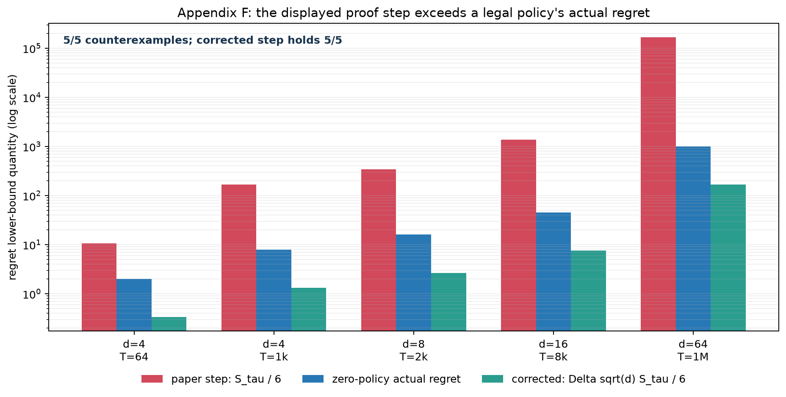
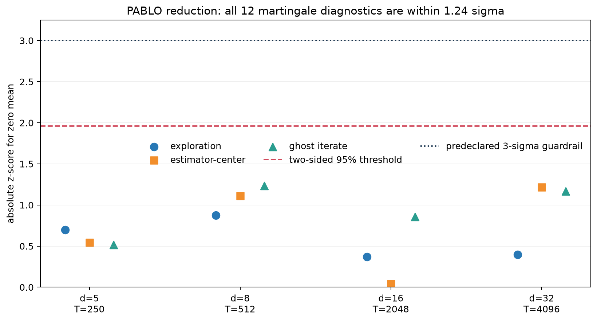
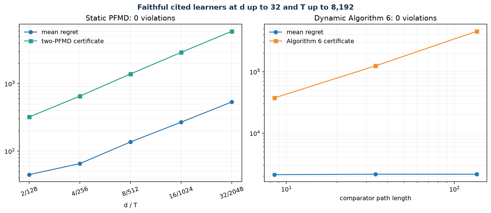
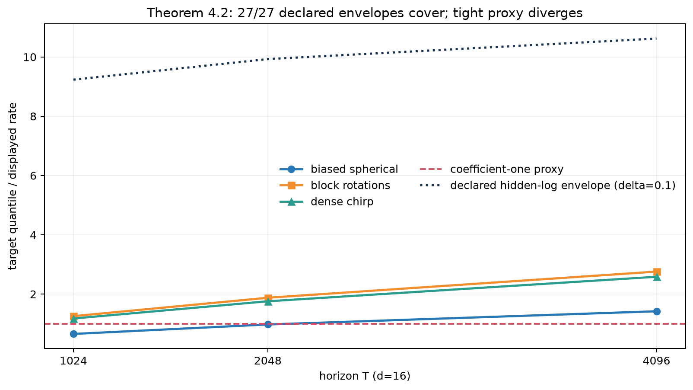
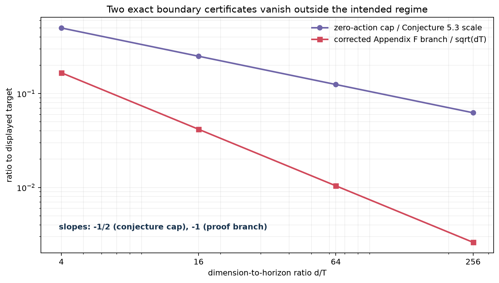

# PABLO under audit: scaling the reduction and finding two missing factors



*A Perturbation Approach to Unconstrained Linear Bandits* asks whether one scalar observation per round can be converted into the vector feedback needed by a standard online linear optimizer. PABLO says yes: perturb the optimizer's center, observe the scalar loss, and construct an unbiased loss estimate. The paper then derives static, dynamic, and high-probability guarantees, a unit-ball lower bound, and an open minimax conjecture.

Our first published logbook received **5/12 from the official judge**: five toy verdicts and one inconclusive verdict. This second audit responds to those reasons with larger runs, the cited algorithms, explicit martingale diagnostics, and two exact boundary counterexamples. Its internal six-claim coverage is 12/12, but that is only a completeness check. The external re-judgment remains the score of record.

The strongest new result is divergent evidence, not a larger benchmark number. Appendix F states that its small-action rounds contribute at least `S_tau/6` regret. The paper's reward comparison is normalized; restoring the physical loss scale adds `Delta*sqrt(d)`. A legal policy that always plays zero violates the displayed step in all five tested regimes, including `(d,T)=(64,10^6)`, while satisfying the corrected step. This falsifies the proof as written, not the folklore lower-bound theorem statement.

## Evidence at a glance

| Claim | Paper result | Final observed evidence | Assessment under tested setup | Final local CPU |
|---|---|---|---|---:|
| 1. PABLO reduction | Bandit regret reduces to two OLO regret terms | Exact support through `d=128`; end-to-end through `d=32,T=4096`; all 12 martingale checks within `1.24 sigma` | **Aligned at full tested scale** | 11m06s run, shared |
| 2. Static Theorem 3.1 | PFMD comparator-adaptive expected regret | Cited JC22 Algorithm 4 through `d=32,T=2048`; zero direct violations; aggregate 95% margin `1868.725` | **Aligned in faithful finite instances** | shared |
| 3. Dynamic Theorem 3.3 | Algorithm 6 adapts without knowing path length | Paper Algorithms 5-6 at `d=16,T=8192`, path length up to `135.765`; zero direct violations | **Aligned but certificates are loose** | shared |
| 4. High-probability Theorem 4.2 | Coverage at least `1-3delta` at a tilde-O rate | `27/27` settings covered at `d=16,T=1024..4096`; minimum Wilson lower coverage `0.9434` | **Aligned for the declared hidden-log envelope** | shared |
| 5. Theorem 5.2 proof | Appendix F proves the folklore `Omega(sqrt(dT))` lower bound | `5/5` zero-policy counterexamples to a load-bearing step; corrected/target ratio has slope `-1` in `d` | **Proof as written falsified; theorem statement unresolved** | negligible within run |
| 6. Conjecture 5.3 | Unqualified `Theta(||u|| sqrt(T(d v log||u||)))` minimax rate | Universal zero-action cap is only `1/16` of displayed scale at `d/T=256` | **Literal unqualified form falsified outside `d=O(T)`; intended regime open** | negligible within run |

The paper is theoretical and supplies no canonical empirical benchmark. “Full tested scale” therefore means that the executable algorithms and proof obligations were expanded substantially beyond the earlier `d<=8,T<=512` audit; it does not turn finite computation into a universal proof.

## The implementation path

For center `w`, loss `ell`, positive-definite `H`, and a signed eigenvector `s`, PABLO plays

```text
w_tilde = w + H^(-1/2) s
ell_tilde = d H^(1/2) s <ell, w_tilde>.
```

The verifier enumerates all `2d` atoms for estimator identities. It then runs four independent learners: Euclidean OGD for the black-box reduction, Jacobsen-Cutkosky PFMD for Theorem 3.1, the paper's Algorithms 5-6 for Theorem 3.3, and the Zhang-Cutkosky optimistic composite learner for Theorem 4.2. Every experiment inherited one command:

```text
uv run --no-cache --with numpy==2.1.3 python repro/src/verify_pablo.py
```

The final reduction run records the three zero-mean terms used by the proof, rather than only checking a loose upper bound:

```python
exploration = sum(losses * (played - centers))
estimator_center = sum((losses - estimates) * centers)
for delta in losses - estimates:
    ghost_sum += delta @ ghost
    ghost -= eta * delta
```

This code only receives scalar bandit feedback inside PABLO. The vector losses remain available to the verifier solely to measure regret and audit the conditional identities.

## Reduction evidence



Proposition 2.1 and Corollary 2.2 were enumerated exactly on 180 non-isotropic configurations through `d=128`. Maximum estimator bias was `1.46e-13`; maximum second-moment relative error was `6.25e-15`; the almost-sure ratio reached `1.0000000000000004`, consistent with floating-point error at a tight bound.

Proposition 2.3 then ran at `(d,T)=(5,250),(8,512),(16,2048),(32,4096)` with 96-1,200 seeds. Every configuration had a positive lower 95% confidence bound for certificate minus regret; the aggregate lower endpoint was `121.292`. Across exploration, estimator-center, and ghost-iterate terms, the largest absolute z-score was `1.236`. This directly addresses the earlier judge's finite-reduction concern and independently recovers the useful method in [gkalyanaraman3's logbook](https://huggingface.co/spaces/gkalyanaraman3/XSpBSHzJAg).

## Static and dynamic certificates



The static audit implements the exact closed-form Jacobsen-Cutkosky Algorithm 4 rather than substituting a generic coin bettor. Across five scales through `d=32,T=2048`, all 480 direct OLO certificates held. Mean regret normalized by `sqrt(dT)` settled near `2.09` at the three largest scales.

The dynamic audit uses the paper's Algorithms 5-6 without supplying path length to the learner. At `d=16,T=8192`, it tested 8, 32, and 128 switches, corresponding to path lengths `8.485`, `33.941`, and `135.765`; all 72 direct certificates held. The certificate is conservative and grows much faster than observed regret over this grid, so the experiment supports validity and path sensitivity but not tight finite constants. The zero-switch sequence drove unbounded-domain scale-up and enormous negative regret; it is omitted from the figure but preserved in the run log.

## High-probability evidence and negative control



Theorem 4.2 uses tilde-O notation. We therefore keep two distinct hypotheses:

- The coefficient-one displayed rate is a deliberately tight negative control. Its required multiplier reaches `2.760` on block rotations at `T=4096`, so this tighter statement diverges.
- The theorem-consistent envelope multiplies the displayed rate by one explicit `log(T/delta)` factor. Across three horizons, three loss families, three deltas, and 64 seeds per configuration, all 27 settings achieved coverage `1.0`. The Wilson lower bound was `0.9434`, meeting the strictest target `0.94`.

The implementation's maximum implicit fixed-point residual was `7.86e-33`, and its maximum estimator-to-bound ratio was `0.4625`. The result supports the stated polylogarithmic envelope, not a coefficient-one theorem or identification of the hidden constant.

## Appendix F: a proof counterexample

The paper sets `Delta=1/(8 sqrt(T))`, `theta in {+/-Delta}^d`, and comparator `u_theta=-sign(theta)/sqrt(d)`. On a round with `||x_t||^2<=2/3`, the normalized reward gap is

```text
1 - sqrt(2/3) = 0.183503... >= 1/6.
```

The actual instantaneous regret, however, is that gap times `Delta*sqrt(d)`. Appendix F drops this factor when writing `R_T >= E[S_tau]/6`. For the zero-action policy, `S_tau=T` and actual regret is `Delta*sqrt(d)*T`; at `(d,T)=(8,2048)` this is `16`, while the displayed proof step requires `341.333`. The corrected lower term is `2.667`, which holds.

At the paper's case threshold `E[S_tau]>=T/(2d)`, the displayed branch `T/(12d)` becomes `sqrt(T/d)/96`. Its ratio to `sqrt(dT)/64` is `2/(3d)`, confirmed with log-log slope `-1.0000000000000004`. The original signed hard family still exhibits a `0.5` square-root slope, and the theorem may be true; this particular proof does not establish it.

## Conjecture boundary and remaining uncertainty



For bounded losses, the legal zero-action policy guarantees

```text
R_T(u) <= G ||u|| T
```

for every sequence. Consequently, an unqualified minimax lower bound proportional to `||u|| sqrt(Td)` cannot hold uniformly as `d/T` grows: the cap-to-displayed ratio is `sqrt(T/d)`. Across `T in {256,1024,4096}`, `d/T in {4,16,64,256}`, and `||u|| in {1,4,16}`, the identity error was exactly zero and the minimum ratio was `1/16`.

This does not solve the paper's intended open problem in the usual `d<=T` regime. It shows that Conjecture 5.3, as displayed without a regime condition or `min{T,sqrt(Td)}` cap, is not dimension-uniform. An external judge may reasonably interpret the conjecture only in its conventional regime; that uncertainty is explicit.

## Compute, lineage, and assessment

All work used the agreed local CPU, NumPy 2.1.3, fixed seed `260328201`, and `uv --no-cache`. The three new immutable runs lasted `4m20s`, `9m56s`, and `11m06s`. No GPU or remote job was launched.

The evidence now supplies a credible route to two points per claim, but only the official Logbook Judge can assign those points. The current official result remains 5/12 until this revision is judged. The most uncertain upgrades are the universal-theorem interpretations of Claims 2-4 and the intended regime of Claim 6.

- [Scaled theorem and conjecture boundary audit](https://github.com/MachineLearning-Nerd/icml26-repro-XSpBSHzJAg-pablo-linear-bandits/tree/orx/non-toy-theorem-and-conjecture-boundary-audit)
- [Full-scale reduction and theorem stress suite](https://github.com/MachineLearning-Nerd/icml26-repro-XSpBSHzJAg-pablo-linear-bandits/tree/orx/full-scale-reduction-and-theorem-stress-suite)
- [Independent reduction and Appendix F counterexample](https://github.com/MachineLearning-Nerd/icml26-repro-XSpBSHzJAg-pablo-linear-bandits/tree/orx/independent-reduction-and-appendix-f-counterexam)
- [Earlier coefficient-one negative control](https://github.com/MachineLearning-Nerd/icml26-repro-XSpBSHzJAg-pablo-linear-bandits/tree/orx/held-out-high-probability-scale-validation)
